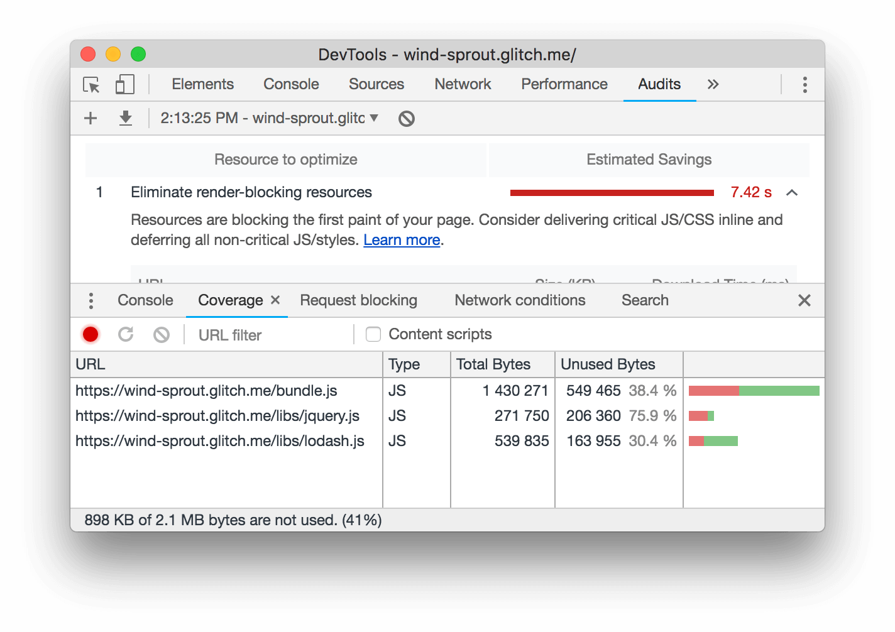
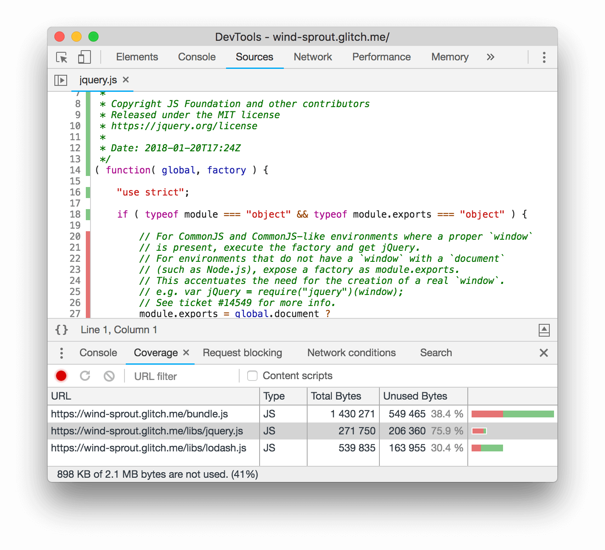
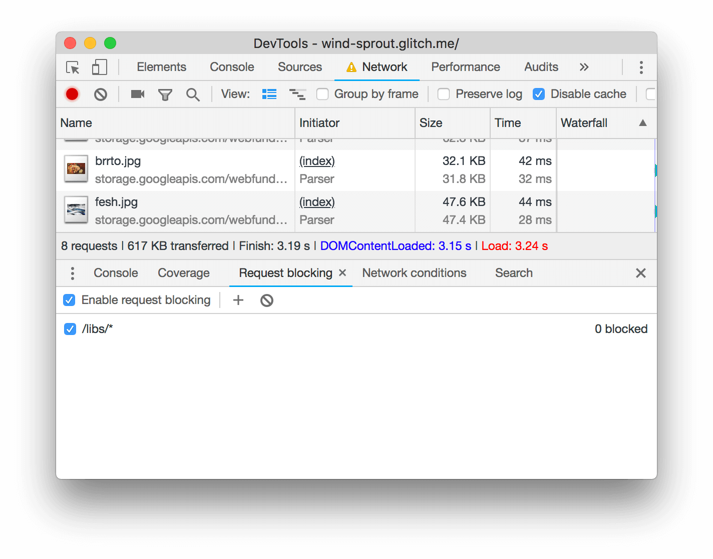
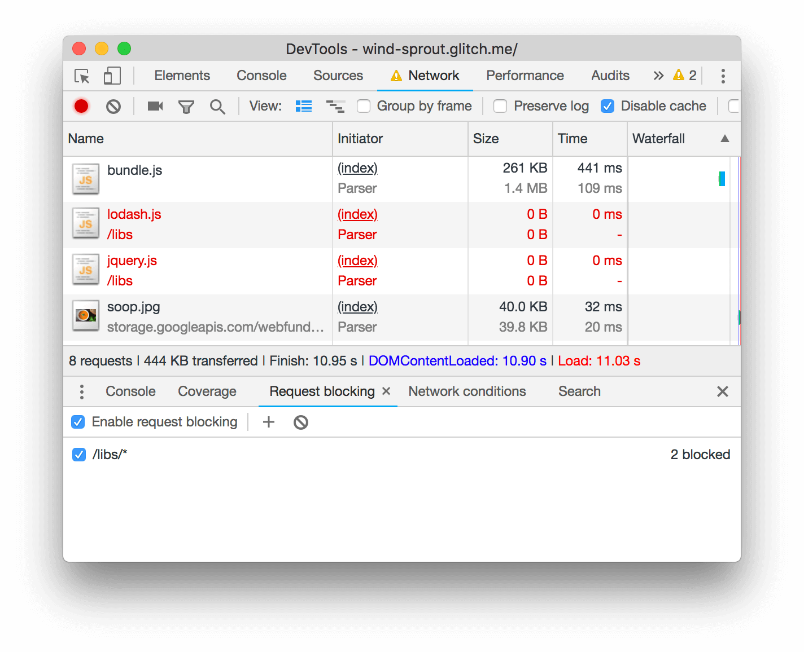

# Chrome 开发者工具 —— 命令行菜单（Command Menu）的使用

> 按下`Command+Shift+P`（Mac）或者`Control+Shift+P`（Windows, Linux）打开命令菜单。

<!-- TOC -->

- [Chrome 开发者工具 —— 命令行菜单（Command Menu）的使用](#chrome-开发者工具--命令行菜单command-menu的使用)
  - [Show Rendering](#show-rendering)
  - [Show Coverage](#show-coverage)
  - [Show Request blocking](#show-request-blocking)

<!-- /TOC -->

## Show Rendering

- 选中 **FPS Meter**（或者 Frame Rendering Stats）, FPS 的实时数据就会显示出来。

## Show Coverage

- 打开 **Coverage**，重新加载页面，**Coverage** 面板下会显示代码的使用情况。
- 选中其中一个文件，DevTools 在 **Soucre** 面板中打开文件，左边的绿色条代表当前行代码已被执行，红色条表示当前行代码从未执行，且不需要在页面加载时使用。

## Show Request blocking

- 打开 **Request blocking**，点击`Add pattern`或者`+`，然后输入需要阻止运行的文件，如`/libs/*`。
- 重新加载页面，所匹配的文件将被阻止运行。
